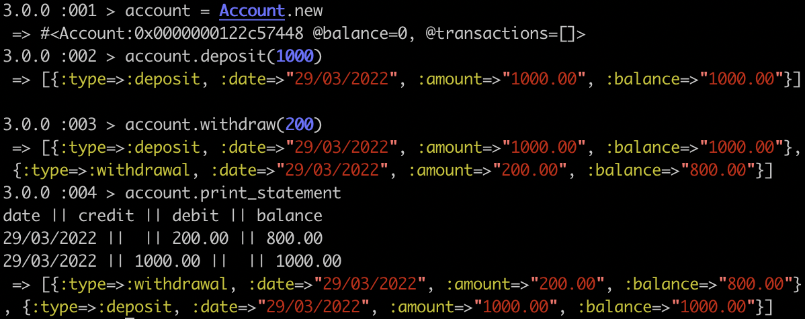

Requirements
------------
You should be able to interact with your code via a REPL like IRB or Node. (You don't need to implement a command line interface that takes input from STDIN.)
Deposits, withdrawal.
Account statement (date, amount, balance) printing.
Data can be kept in memory (it doesn't need to be stored to a database or anything).


Acceptance criteria
-------------------
Given a client makes a deposit of 1000 on 10-01-2023
And a deposit of 2000 on 13-01-2023
And a withdrawal of 500 on 14-01-2023
When she prints her bank statement
Then she would see
```
date || credit || debit || balance
14/01/2023 || || 500.00 || 2500.00
13/01/2023 || 2000.00 || || 3000.00
10/01/2023 || 1000.00 || || 1000.00
```

How to run the code
-------------------

The following is an example of how to run the code in IRB and how each method is called.

From the command line:




Process
-------

I began by creating four user stories:

```
As a client
So I can store my money
I'd like to be able to make a deposit to my account

As a client
So I can retrieve my money
I'd like to be able to make a withdrawal from my account

As a client
So I can see how much money I have
I'd like to be able to print a statement showing my balance

As a client
So I can keep track of my money
I'd like to see the date of transactions (deposits (credit) & withdrawals (debit)) on my statement
```

I then wrote my first feature test, and then wrote my first unit test so that the errors from each were matching.
From here I used a TDD approach with a red, green, refactor style to build the program.
